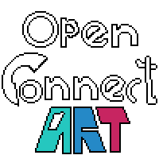

# Open connect ART

This is an ART project to teach you how to contribute and make use of an opportunity to use art and engineering to create a master piece.

Anyone who wished to learn how to create a pull request for a project on GitHub can use this project to contribute 1 or maximum 2 tile on the canvas. 
* You will be able to create only 1 PR for the tile that is empty.
* The second PR should be created if your neighboring tile does not match and it a dead lock or a mismatch, this way you can ask other contributor to collaborate and fix the dead lock.

## Contributing  

In order to contribute a tile to the canvas you'll have to create a [pull request](https://opensource.guide/how-to-contribute/#opening-a-pull-request). please check the [Contributing guide](CONTRIBUTIN.md) 

## Code of conduct 

The goal of this project is to complete the canvas in highly respectful and fun manner. 